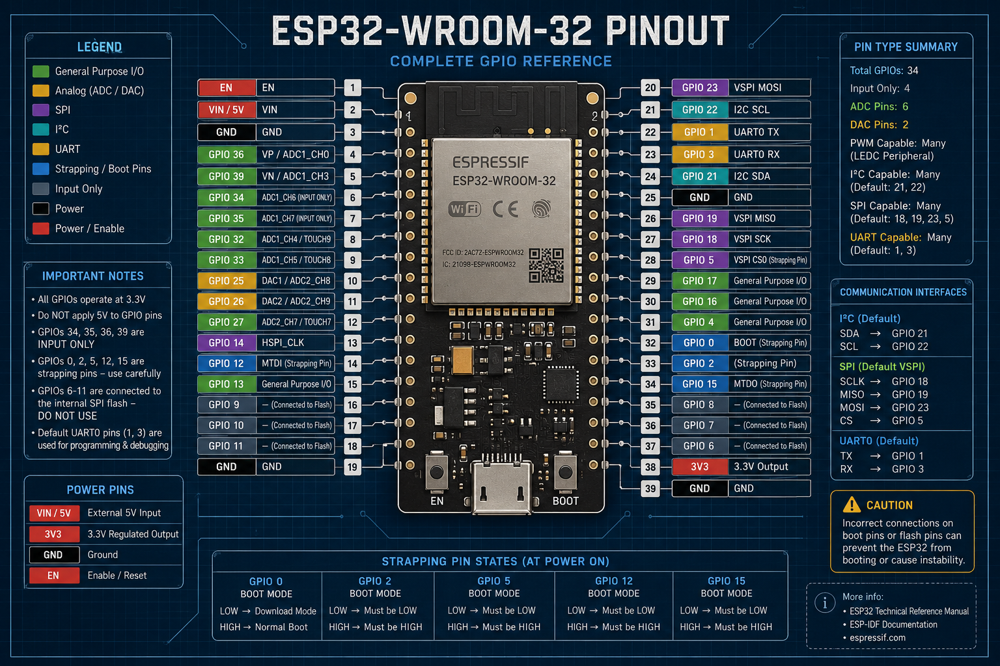

# The ESP32 Developer Handbook 🧠💻

> **From cube turns to code lines.**

A developer-focused knowledge base for understanding the **Espressif ESP32 ecosystem** — from hardware architecture and GPIOs to wireless communication, software frameworks, embedded systems, and real-world edge applications.

The goal of this repository is simple:

> **Help developers understand not only how to program an ESP32, but how the hardware and software work together.**

---

## 📚 Documentation

### 🔌 Hardware

| Guide                                                                      | Description                                                                      |
| -------------------------------------------------------------------------- | -------------------------------------------------------------------------------- |
| 📘 [ESP32-WROOM-32 Pinout Guide](./esp32-wroom/PIN-output_guide.md)        | Complete GPIO, power, ADC, DAC, SPI, I²C, UART, boot and strapping-pin reference |
| 🖼️ [ESP32-WROOM-32 Pinout Image](./esp32-wroom/esp32-wroom-32-pinout.png) | Visual blueprint of the ESP32-WROOM-32 pins                                      |
| 📘 [ESP32-S3 Guide](./esp32-S3.md)                                         | ESP32-S3 architecture and capabilities                                           |
| 📘 [ESP32-C6 Guide](./esp32_C6.md)                                         | ESP32-C6 architecture and capabilities                                           |

---

## 🔌 ESP32-WROOM-32 Pinout

The **ESP32-WROOM-32** is one of the most commonly used ESP32 modules.

Before connecting sensors, displays, motors, or communication modules, it is important to understand the capabilities and restrictions of each GPIO.

### Pinout Blueprint

<p align="center">
  
</p>

### 📖 Complete Guide

👉 **[Read the ESP32-WROOM-32 Pin Output Guide →](./esp32-wroom/PIN-output_guide.md)**

The guide covers:

* GPIO functions
* Input-only GPIOs
* Boot and strapping pins
* Flash-connected GPIOs
* ADC
* DAC
* PWM
* I²C
* SPI
* UART
* Power pins
* GPIO selection
* Common hardware mistakes
* Practical pin assignments

---

# 1. The Silicon: Choosing the Right ESP32

The ESP32 is not a single chip. It is a growing family of SoCs with different CPU architectures, wireless capabilities, peripherals, memory configurations, and target applications.

Using an ESP32-S3 for a simple battery-powered sensor may be unnecessary, while using a smaller ESP32-C3 for a demanding vision application would be inappropriate.

| Chip Family  | Architecture           | Key Feature                     | Best For                            |
| ------------ | ---------------------- | ------------------------------- | ----------------------------------- |
| **ESP32**    | Dual-Core Xtensa LX6   | Wi-Fi + Bluetooth Classic + BLE | General IoT, legacy projects        |
| **ESP32-S2** | Single-Core Xtensa LX7 | Native USB                      | USB devices, low-power applications |
| **ESP32-S3** | Dual-Core Xtensa LX7   | Vector instructions + USB       | Edge AI, vision, voice              |
| **ESP32-C3** | Single-Core RISC-V     | Low power + low cost            | Sensors, IoT nodes                  |
| **ESP32-C6** | Single-Core RISC-V     | Wi-Fi 6 + 802.15.4              | Matter, Thread, Zigbee              |
| **ESP32-H2** | Single-Core RISC-V     | 802.15.4 + BLE                  | Mesh and low-power devices          |
| **ESP32-P4** | Dual-Core RISC-V       | High-performance MCU            | HMI, multimedia, edge processing    |

---

# 2. The Frameworks: Writing the Code

Which development environment should you use?

### Arduino Core

Best for:

* Rapid prototyping
* Learning
* Hardware testing
* Simple IoT projects
* Large community libraries

### ESP-IDF

Espressif's official development framework.

Best for:

* Production firmware
* Fine-grained hardware control
* FreeRTOS applications
* Memory management
* Security features
* Complex multitasking

### MicroPython / CircuitPython

Useful for:

* Education
* Rapid experimentation
* Sensor projects
* Scripting
* Fast prototyping

---

# 3. ESP32 Architecture

Understanding the ESP32 means understanding how its major subsystems interact.

```text
                         ESP32
                           │
          ┌────────────────┼────────────────┐
          │                │                │
         CPU             Memory          Wireless
          │                │                │
     ┌────┴────┐      ┌────┴────┐      ┌───┴────┐
     │         │      │         │      │        │
   Core 0    Core 1   ROM      SRAM   Wi-Fi   Bluetooth
                              │
                           Flash
                              │
                    ┌─────────┴─────────┐
                    │                   │
               Peripherals          Interfaces
                    │                   │
              GPIO / ADC             SPI
              DAC / PWM              I²C
              Timers                 UART
              Interrupts             I²S
```

---

# 4. Communication Interfaces

The ESP32 provides multiple hardware communication interfaces.

## I²C

Common default pins:

```text
SDA → GPIO 21
SCL → GPIO 22
```

Typical applications:

* OLED displays
* IMUs
* Temperature sensors
* RTC modules
* GPIO expanders

---

## SPI

Common VSPI configuration:

```text
SCLK → GPIO 18
MISO → GPIO 19
MOSI → GPIO 23
CS   → GPIO 5
```

Typical applications:

* TFT displays
* SD cards
* RFID
* Flash memory
* High-speed sensors

---

## UART

Common UART0 pins:

```text
TX → GPIO 1
RX → GPIO 3
```

Typical applications:

* GPS
* GSM modules
* Serial sensors
* Debugging

---

# 5. Wireless Architecture

ESP32 devices are particularly useful because many variants combine powerful peripherals with wireless connectivity.

```text
                         ESP32
                           │
                ┌──────────┴──────────┐
                │                     │
              Wi-Fi               Bluetooth
                │                     │
           ┌────┴────┐          ┌─────┴─────┐
           │         │          │           │
          TCP       UDP        BLE        Classic
           │
       ┌───┴────┐
       │        │
      HTTP     MQTT
```

Future documentation will cover:

* Wi-Fi
* SoftAP
* HTTP
* WebSockets
* MQTT
* ESP-NOW
* Bluetooth Classic
* Bluetooth Low Energy
* BLE GATT
* BLE HID

---

# 6. Edge Use Cases & Code Templates

This repository also contains practical examples for real-world embedded systems.

### Current / Planned Examples

* 📂 `/local-web-server` — Local ESP32 web interface
* 📂 `/ble-hid-controller` — Bluetooth HID controller
* 📂 `/wearable-optics` — I²C/SPI display systems
* 📂 `/edge-ai-vision` — Edge AI and computer vision
* 📂 `/sensor-node` — Environmental monitoring
* 📂 `/smart-home` — Local IoT automation

---

# 7. Developer Resources

The repository will gradually include:

```text
Hardware
├── Pinouts
├── GPIO
├── ADC / DAC
├── PWM
├── Timers
├── Interrupts
├── Memory
└── Power Management

Communication
├── UART
├── I²C
├── SPI
├── I²S
├── Wi-Fi
├── Bluetooth
├── BLE
└── ESP-NOW

Software
├── Arduino
├── ESP-IDF
├── FreeRTOS
├── MicroPython
└── PlatformIO

Applications
├── IoT
├── BLE HID
├── Edge AI
├── Wearables
├── Robotics
└── Automation
```

---

# 8. Quick Navigation

### Hardware

* 🔌 [ESP32-WROOM-32 Pinout](./esp32-wroom/PIN-output_guide.md)
* 🖼️ [ESP32-WROOM-32 Blueprint](./esp32-wroom/esp32-wroom-32-pinout.png)
* 🧠 [ESP32-S3](./esp32-S3.md)
* 📡 [ESP32-C6](./esp32_C6.md)

### Software

* Arduino Core
* ESP-IDF
* FreeRTOS
* MicroPython

### Communication

* I²C
* SPI
* UART
* Wi-Fi
* Bluetooth
* BLE
* ESP-NOW

---

# 9. Contributing

This is an open developer knowledge base.

If you find:

* Incorrect pin information
* Outdated documentation
* Missing examples
* Hardware mistakes
* Better diagrams
* Useful ESP32 projects

feel free to open an **Issue** or submit a **Pull Request**.

Contributions and corrections are welcome.

---

# 👨‍💻 About the Author

**Abhay Haswani**

> From cube turns to code lines.

I specialize in hardware-software integration, focusing on systems that bridge the physical and digital worlds.

My work explores:

* Embedded systems
* ESP32
* Bluetooth HID
* IoT
* Edge computing
* Local-first systems
* Hardware/software integration

### Links

* GitHub: [User-4162686179](https://github.com/User-4162686179)
* LinkedIn: [Abhay Haswani](https://linkedin.com/in/abhay-haswani-235493254)

---

## ⭐ Support the Project

If this repository helps you understand the ESP32 ecosystem:

**⭐ Star the repository**

**🍴 Fork it**

**🐛 Report issues**

**🔧 Contribute improvements**

---

## 📜 License

This repository is intended as an open developer reference.

See the repository license for usage and contribution terms.
