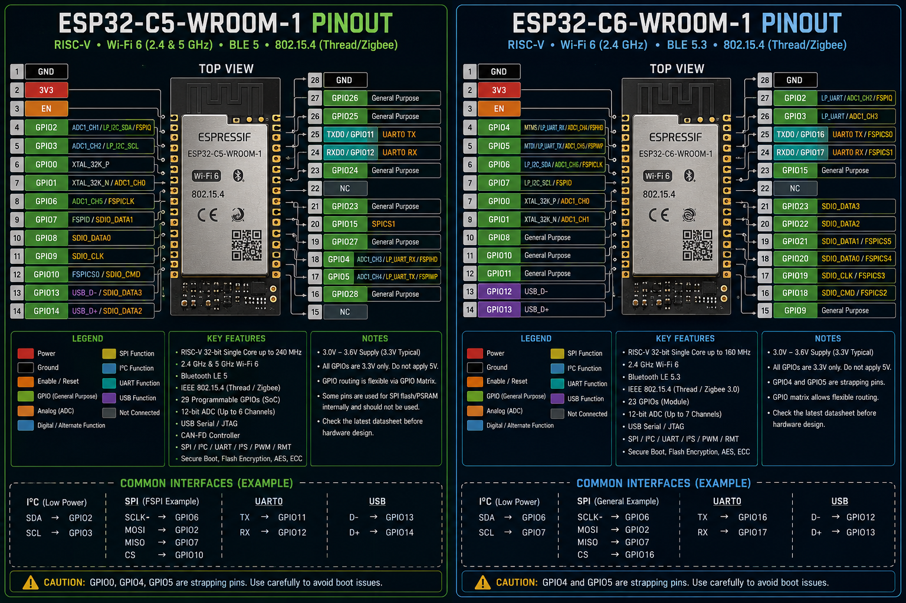

# ESP32-C5 GPIO & Pin Output Developer Guide

> A practical developer reference for the ESP32-C5, covering GPIOs, ADC, communication interfaces, boot configuration, power, wireless capabilities, and hardware design considerations.

---

## 🚀 Introduction

The **ESP32-C5** is a modern Espressif SoC built around a **32-bit RISC-V processor** and designed for connected IoT applications.

Unlike the original ESP32, the ESP32-C5 introduces **dual-band 2.4 GHz and 5 GHz Wi-Fi 6**, while also supporting Bluetooth LE, Thread, and Zigbee.

The ESP32-C5 supports up to **29 programmable GPIOs at the SoC level**, along with ADC, UART, SPI, I²C, I²S, USB Serial/JTAG, CAN-FD, PWM, RMT, and other peripherals.

> **Important:** This document focuses on the ESP32-C5 SoC and the **ESP32-C5-WROOM-1/WROOM-1U module**. The number of GPIOs physically exposed depends on the package/module.

---

# 🧠 ESP32-C5 Architecture

```text
                         ESP32-C5
                            │
          ┌─────────────────┼─────────────────┐
          │                 │                 │
       RISC-V CPU         Memory           Wireless
          │                 │                 │
      ┌───┴───┐        ┌────┴────┐       ┌────┴────┐
      │       │        │         │       │         │
      HP     LP       ROM       SRAM    Wi-Fi 6  BLE
    RISC-V RISC-V                         │
                                      2.4 / 5 GHz
                                           │
                                      802.15.4
                                      Thread/Zigbee
```

The current ESP32-C5 documentation describes:

* High-performance RISC-V CPU up to 240 MHz
* Low-power RISC-V CPU up to 48 MHz
* 320 KB ROM
* 384 KB HP SRAM
* 16 KB LP SRAM
* Wi-Fi 6
* Bluetooth LE
* IEEE 802.15.4
* Hardware security acceleration
* 29 programmable GPIOs
* ADC
* CAN-FD
* USB Serial/JTAG
* SPI
* I²C
* UART
* I²S
* PWM
* RMT
* GDMA

---
<p align="center">
  
</p>

# 📡 Wireless Capabilities

One of the major reasons to use the ESP32-C5 is its wireless architecture.

### Wi-Fi

The ESP32-C5 supports:

```text
2.4 GHz Wi-Fi 6
5 GHz Wi-Fi 6
802.11a/b/g/n/ac/ax
```

It supports features such as:

* OFDMA
* MU-MIMO
* Target Wake Time
* Beamforming
* Station mode
* SoftAP
* Station + SoftAP
* Promiscuous mode

### Bluetooth

ESP32-C5 provides Bluetooth Low Energy and supports modern BLE features including Bluetooth Core 6.0 certification in the current datasheet.

### 802.15.4  version

ESP32-C5 also supports:

```text
IEEE 802.15.4
      │
      ├── Thread
      └── Zigbee
```

This makes C5 suitable for modern low-power mesh and Matter-related applications.

---

# 🔌 ESP32-C5-WROOM-1 Pinout

The ESP32-C5-WROOM-1 module exposes a subset of the ESP32-C5 SoC GPIOs.

The module has **29 physical pins**, while the WROOM-1U variant has additional antenna-related connections.

### Module Pin Layout

```text
                    ESP32-C5-WROOM-1

             ┌───────────────────────┐
             │       ESP32-C5        │
             │                       │
 GND ────────┤ 1                  28 ├──── GND
 3V3 ────────┤ 2                  27 ├──── GPIO26
 EN ─────────┤ 3                  26 ├──── GPIO25
 GPIO2 ──────┤ 4                  25 ├──── TX0 / GPIO11
 GPIO3 ──────┤ 5                  24 ├──── RX0 / GPIO12
 GPIO0 ──────┤ 6                  23 ├──── GPIO24
 GPIO1 ──────┤ 7                  22 ├──── NC
 GPIO6 ──────┤ 8                  21 ├──── GPIO23
 GPIO7 ──────┤ 9                  20 ├──── NC
 GPIO8 ──────┤10                  19 ├──── GPIO15
 GPIO9 ──────┤11                  18 ├──── GPIO27
 GPIO10 ─────┤12                  17 ├──── GPIO4
 GPIO13 ─────┤13                  16 ├──── GPIO5
 GPIO14 ─────┤14                  15 ├──── GPIO28
             └───────────────────────┘
```

The official C5-WROOM-1 datasheet defines these module pins and their alternate functions.

---

# 📋 ESP32-C5-WROOM-1 GPIO Reference

|   GPIO | Alternate / Important Functions       | Notes        |
| -----: | ------------------------------------- | ------------ |
|  GPIO0 | XTAL_32K_P / LP functions             | General GPIO |
|  GPIO1 | XTAL_32K_N / ADC1_CH0                 | ADC          |
|  GPIO2 | MTMS / LP I²C SDA / ADC1_CH1 / FSPIQ  | Multiplexed  |
|  GPIO3 | MTDI / LP I²C SCL / ADC1_CH2          | Multiplexed  |
|  GPIO4 | MTCK / LP UART RX / ADC1_CH3 / FSPIHD | Multiplexed  |
|  GPIO5 | MTDO / LP UART TX / ADC1_CH4 / FSPIWP | Multiplexed  |
|  GPIO6 | ADC1_CH5 / FSPICLK                    | ADC / SPI    |
|  GPIO7 | FSPID / SDIO_DATA1                    | SPI / SDIO   |
|  GPIO8 | SDIO_DATA0                            | Digital      |
|  GPIO9 | SDIO_CLK                              | Digital      |
| GPIO10 | FSPICS0 / SDIO_CMD                    | SPI          |
| GPIO11 | UART0 TX                              | Serial       |
| GPIO12 | UART0 RX                              | Serial       |
| GPIO13 | USB_D- / SDIO_DATA3                   | USB          |
| GPIO14 | USB_D+ / SDIO_DATA2                   | USB          |
| GPIO15 | SPICS1                                | SPI          |
| GPIO23 | General GPIO                          | Digital      |
| GPIO24 | General GPIO                          | Digital      |
| GPIO25 | General GPIO                          | Digital      |
| GPIO26 | General GPIO                          | Digital      |
| GPIO27 | General GPIO                          | Digital      |
| GPIO28 | General GPIO                          | Digital      |

---

# 📊 ADC

ESP32-C5 provides a **12-bit SAR ADC with up to six channels**.

The commonly exposed ADC channels on the WROOM module include:

```text
GPIO1 → ADC1_CH0
GPIO2 → ADC1_CH1
GPIO3 → ADC1_CH2
GPIO4 → ADC1_CH3
GPIO5 → ADC1_CH4
GPIO6 → ADC1_CH5
```

This makes these GPIOs useful for:

* Potentiometers
* Analog sensors
* Battery monitoring
* Voltage measurement
* Environmental sensors

---

# 🔄 SPI

ESP32-C5 provides SPI controllers and flexible GPIO routing.

Common C5-WROOM SPI-related pins include:

```text
GPIO6  → FSPICLK
GPIO7  → FSPID
GPIO10 → FSPICS0
GPIO15 → SPICS1
GPIO2  → FSPIQ
GPIO4  → FSPIHD
GPIO5  → FSPIWP
```

The exact assignment should be selected through the ESP32-C5 GPIO matrix and peripheral configuration.

---

# 📡 I²C

ESP32-C5 supports both:

```text
High-performance I²C
Low-power I²C
```

Some low-power I²C functions are exposed through:

```text
GPIO2 → LP_I2C_SDA
GPIO3 → LP_I2C_SCL
```

Unlike older ESP32 boards, do not assume that **GPIO21/GPIO22 are the universal I²C pins**. ESP32-C5 uses a more flexible pin-multiplexing architecture.

---

# 📶 UART

The ESP32-C5 provides multiple UART resources.

The WROOM module exposes:

```text
GPIO11 → UART0 TX
GPIO12 → UART0 RX
```

These pins are commonly useful for:

* Serial debugging
* GPS
* GSM
* External MCUs
* Serial sensors

---

# 🔌 USB

ESP32-C5 provides a **USB Serial/JTAG controller**.

The WROOM module exposes USB-related signals through:

```text
GPIO13 → USB_D-
GPIO14 → USB_D+
```

This can be useful for:

* USB communication
* Serial/JTAG debugging
* Development tools
* USB-connected embedded devices

---

# 🚗 CAN-FD

A particularly interesting feature of ESP32-C5 is its hardware support for **CAN-FD**.

This opens applications such as:

* Automotive interfaces
* Robotics
* Industrial automation
* Motor controllers
* Distributed embedded systems

The current ESP32-C5 datasheet lists **two CAN-FD controllers**.

---

# ⚡ Power

For the ESP32-C5-WROOM module:

```text
3V3 → 3.3 V supply
EN  → Chip enable / reset
GND → Ground
```

The ESP32-C5-WROOM datasheet specifies a module operating supply in the **3.0–3.6 V range**.

### ⚠️ Never apply 5 V directly to GPIO

```text
5V ──────── GPIO ❌

3.3V ────── GPIO ✅
```

Use a proper level shifter or voltage-divider circuit when interfacing with 5 V logic.

---

# 🧠 GPIO Matrix

One of the most important concepts for ESP32-C5 developers is the **GPIO Matrix**.

Instead of permanently assigning every peripheral to a single GPIO, ESP32-C5 can route peripheral signals through configurable IO MUX/GPIO Matrix connections.

Conceptually:

```text
                 Peripheral
                     │
              GPIO Matrix
                     │
        ┌────────────┼────────────┐
        │            │            │
      GPIO2        GPIO10       GPIO23
```

This gives developers much greater flexibility when designing custom boards.

---

# 🔐 Security

ESP32-C5 includes hardware security features including:

```text
AES
SHA
RSA
ECC
HMAC
Secure Boot
Flash Encryption
True Random Number Generator
Digital Signature
Key Manager
```

---

# 🛠️ Recommended GPIO Strategy

Before selecting a GPIO:

```text
1. Check alternate functions
        ↓
2. Check boot restrictions
        ↓
3. Check ADC/USB/SPI requirements
        ↓
4. Check whether the GPIO is used by flash
        ↓
5. Check voltage levels
        ↓
6. Assign the peripheral
```

---

# 💡 Example Sensor Node

A possible application architecture:

```text
             ESP32-C5
                 │
       ┌─────────┼─────────┐
       │         │         │
      ADC       I²C      UART
       │         │         │
    Sensor     OLED      GPS
       │
       └─────────┬─────────
                 │
              Wi-Fi 6
                 │
              MQTT
                 │
             Local Server
```

---

# 🚨 Important Developer Notes

* ESP32-C5 GPIO functions are highly multiplexed.
* Do not assume the original ESP32 GPIO layout applies to C5.
* GPIO availability differs between the **SoC and WROOM module**.
* Check the exact module variant before designing a PCB.
* USB pins have dedicated alternate functions.
* SPI flash/PSRAM connections should not be treated as ordinary GPIO.
* Always check the current Espressif datasheet before final PCB design.

---

# 📚 Official References

* [ESP32-C5 Series Datasheet](https://documentation.espressif.com/esp32-c5_datasheet_en.html)
* [ESP32-C5-WROOM-1 Datasheet](https://documentation.espressif.com/esp32-c5-wroom-1_wroom-1u_datasheet_en.html)
* [Espressif Technical Documentation](https://www.espressif.com/en/support/download/documents/chips)

---

## ⭐ Summary

ESP32-C5 is particularly interesting for developers who need:

```text
Wi-Fi 6
   +
2.4 GHz + 5 GHz
   +
Bluetooth LE
   +
Thread / Zigbee
   +
RISC-V
   +
USB
   +
CAN-FD
   +
Low-power processing
```

It is a strong candidate for modern IoT gateways, industrial nodes, smart-home devices, robotics, and connected embedded systems.
