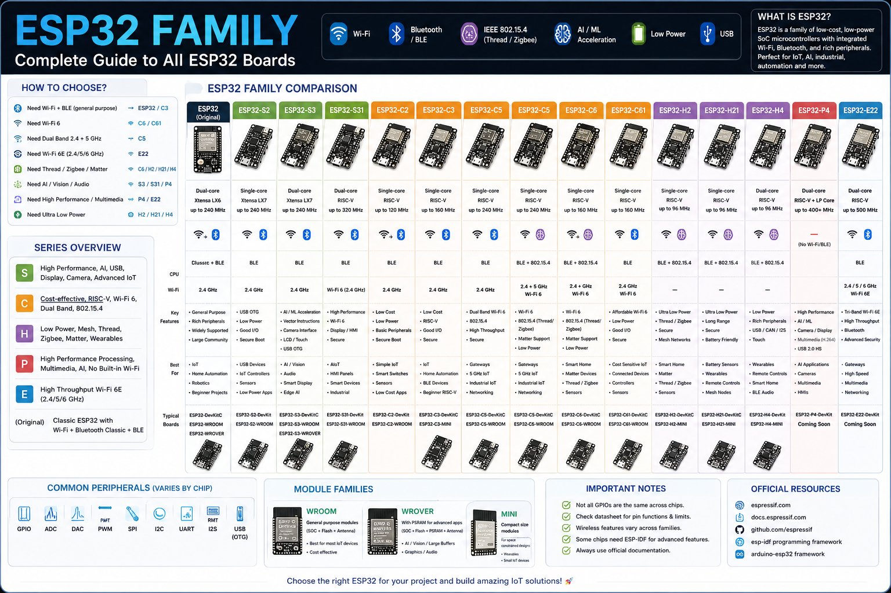

# 🌐 ESP32 Family Guide

> A developer-friendly overview of the ESP32 ecosystem, including major SoC families, their architectures, connectivity, strengths, and practical use cases.

---

## 📚 Table of Contents

- [What is ESP32?](#-what-is-esp32)
- [SoC vs Module vs Development Board](#-soc-vs-module-vs-development-board)
- [ESP32 Family Tree](#-esp32-family-tree)
- [Quick Comparison](#-quick-comparison)
- [Original ESP32](#-original-esp32)
- [ESP32-S Series](#-esp32-s-series)
- [ESP32-C Series](#-esp32-c-series)
- [ESP32-H Series](#-esp32-h-series)
- [ESP32-P Series](#-esp32-p-series)
- [ESP32-E Series](#-esp32-e-series)
- [Choosing an ESP32](#-choosing-an-esp32)
- [Use-Case Selection](#-use-case-selection)
- [ESP32 Modules](#-esp32-modules)
- [Development Boards](#-development-boards)
- [ESP32 Naming](#-esp32-naming)
- [Important Compatibility Notes](#-important-compatibility-notes)
- [Learning Path](#-recommended-learning-path)
- [Official Resources](#-official-resources)

---

# 🌐 What is ESP32?

ESP32 is not a single microcontroller.

It is a family of System-on-Chips (SoCs), modules, and development boards designed for:

- IoT
- Embedded systems
- Wireless communication
- Smart-home devices
- Industrial automation
- Robotics
- AI
- Computer vision
- Audio
- HMI
- Low-power sensors
- Wireless gateways

The ESP32 ecosystem contains different CPU architectures, wireless technologies, memory configurations, and peripheral sets.

Therefore:

> **Do not treat every ESP32 board as electrically or functionally identical.**

Always check the documentation for the exact SoC/module/board you are using.

---



# 🧩 SoC vs Module vs Development Board

Understanding this distinction is important when working with ESP32 hardware.

## 1. SoC

**SoC = System on Chip**

This is the actual semiconductor device.

Examples:

```text
ESP32
ESP32-C3
ESP32-C5
ESP32-C6
ESP32-S3
ESP32-H2
ESP32-P4